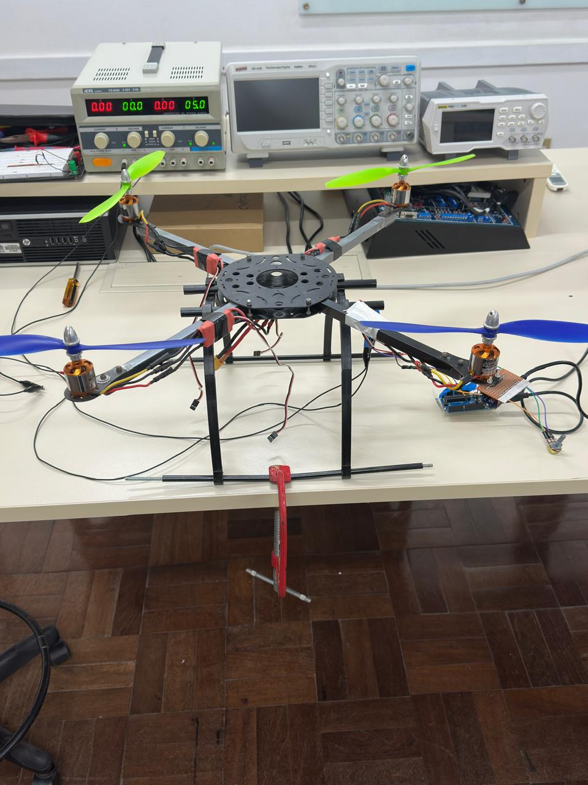

# 2025.2 - DEC0021 - Detecção de Anomalias em Hélices de VANTs com Edge AI

> Projeto de Trabalho de Conclusão de Curso (TCC) - UFSC Campus Araranguá

Este repositório contém o código-fonte, esquemas e documentação do sistema embarcado desenvolvido para detectar falhas estruturais e operacionais (desbalanceamento) em sistemas rotativos de drones utilizando Inteligência Artificial na borda (*TinyML*).

**Autor:** [Nikolas Lopes]  
**Orientador:** [Prof. Rodrigo Pereira, DR.]

---

## 📸 Galeria do Projeto

<table>
  <tr>
    <td align="center">
      
      <br />
      <b>Bancada de Testes Experimental</b>
    </td>
    <td align="center">
      
      <br />
      <b>Detalhe da Montagem do Sensor</b>
    </td>
  </tr>
</table>

---

## 📖 Introdução

A segurança operacional de Veículos Aéreos Não Tripulados (VANTs) depende criticamente da integridade de seus sistemas de propulsão. Falhas em hélices, como rachaduras ou desbalanceamentos, podem levar a vibrações excessivas e quedas catastróficas.

Este projeto propõe uma solução de baixo custo baseada em **Edge AI** (Inteligência Artificial na Borda). Utilizando um microcontrolador **Arduino Nano 33 BLE Sense** e a plataforma **Edge Impulse**, desenvolvemos um modelo capaz de classificar em tempo real, através da análise de vibração (FFT), os seguintes estados operacionais:

1. **Motor Parado**
2. **Motor Ligando** (Transitório)
3. **Motor Ligado** (Operação Normal)
4. **Anomalia** (Hélice Desbalanceada/Danificada)

A solução elimina a necessidade de telemetria para a nuvem, garantindo latência mínima (<20ms) e maior autonomia.

---

## 📊 Resultados Obtidos

O modelo de TinyML demonstrou alta eficácia na distinção entre estados normais e de falha. Abaixo, os resultados de validação e métricas de desempenho:

### Matriz de Confusão
<div align="center">
  
  <p><i>Demonstração da precisão na classificação dos estados. Note a clara separação entre "Motor Ligado" e "Anomalia".</i></p>
</div>

### Métricas Detalhadas (F1-Score)
<div align="center">
  
</div>

---

## ⚙️ Pipeline de Machine Learning

O desenvolvimento seguiu o ciclo de vida de Edge AI padrão:
1. **Coleta de Dados:** Acelerômetro 3 eixos a 100Hz.
2. **Processamento (DSP):** Filtro Passa-Alta + FFT (Análise Espectral).
3. **Classificação:** Rede Neural Densa (DNN).

<div align="center">
  
</div>

> *Distribuição dos dados coletados para treinamento e teste:*
> 

---

## 🛠 Hardware Necessário

Lista de materiais utilizados na construção da bancada de testes e do sistema embarcado:

| Componente | Modelo Específico | Função |
| :--- | :--- | :--- |
| **Microcontrolador** | Arduino Nano 33 BLE Sense | Processamento de IA e leitura do sensor IMU (LSM9DS1). |
| **Motor Brushless** | D2836 (Série 2217) - 1000KV | Propulsão principal do sistema de teste ([Ver Manual](docs/Brushless_Motor_Instruction (1).pdf)). |
| **ESC** | Controlador de 40A | Controle de velocidade do motor. |
| **Hélices** | Modelo 1045 (Plástico) | Uma íntegra e outra com fita adesiva para simular desbalanceamento. |
| **Fonte de Bancada** | Ajustável (12V) | Simulação de bateria LiPo 3S. |

---

## 🔌 Esquema de Conexão

A conexão física é simplificada devido aos sensores integrados do Nano 33 BLE Sense.

1. **Fixação do Sensor:** O Arduino deve ser fixado rigidamente à base do motor (usando fita dupla face forte e abraçadeiras) para garantir que o acelerômetro interno capture as vibrações mecânicas.
2. **Alimentação:** O Arduino é alimentado via cabo USB (durante o desenvolvimento/monitoramento serial).
3. **Controle do Motor:** O ESC é conectado ao motor (3 fios) e alimentado pela fonte 12V. O sinal de controle PWM do ESC pode ser gerado por um gerador de sinal externo ou por um pino PWM de outro microcontrolador auxiliar.

---

## 🚀 Como Reproduzir

### 1. Instalação
*   Instale a [Arduino IDE](https://www.arduino.cc/en/software).
*   Adicione o suporte para placas **Arduino Mbed OS Nano Boards**.
*   Clone este repositório:
    ```
    git clone https://github.com/repositorio-code/-2025.2-_-DEC0021-_-Detec-o-de-Anomalias-em-H-lices-de-VANTs-com-Edge-AI-/
    ```

### 2. Importando a Biblioteca
O modelo de IA treinado foi exportado como uma biblioteca Arduino.
1. Baixe o arquivo `.zip` da biblioteca (disponível na pasta `/library` deste repositório).
2. No Arduino IDE, vá em `Sketch > Include Library > Add .ZIP Library...` e selecione o arquivo.

### 3. Carregando o Código
O código principal (`main.ino`) está localizado na pasta `/src`.
*   Abra o arquivo no Arduino IDE.
*   Compile e carregue para a placa.

---

## 💻 Funcionamento do Firmware

O código realiza o seguinte fluxo em loop:

1. **Leitura:** Coleta dados de aceleração (eixos X, Y, Z).
2. **DSP:** Preenche o buffer de processamento digital de sinais.
3. **Inferência:** Executa a Rede Neural (TFLite Micro).
4. **Saída:** Imprime no Serial Monitor a classe detectada e sua probabilidade.

## 📚 Referências e Soluções

Durante o desenvolvimento, alguns desafios foram superados:

*   **Data Collection:** Utilizamos o *Data Forwarder* do Edge Impulse CLI para enviar dados do Arduino via Serial.
*   **Ruído:** O uso de cabos blindados e fixação rígida do Arduino com abraçadeiras eliminou leituras falsas causadas por fios soltos.
*   **Amostragem:** Taxa de 100Hz definida para respeitar o Teorema de Nyquist para a rotação máxima do motor.

---

## 📄 Licença

Este projeto é de código aberto e está licenciado sob a [MIT License](LICENSE).
